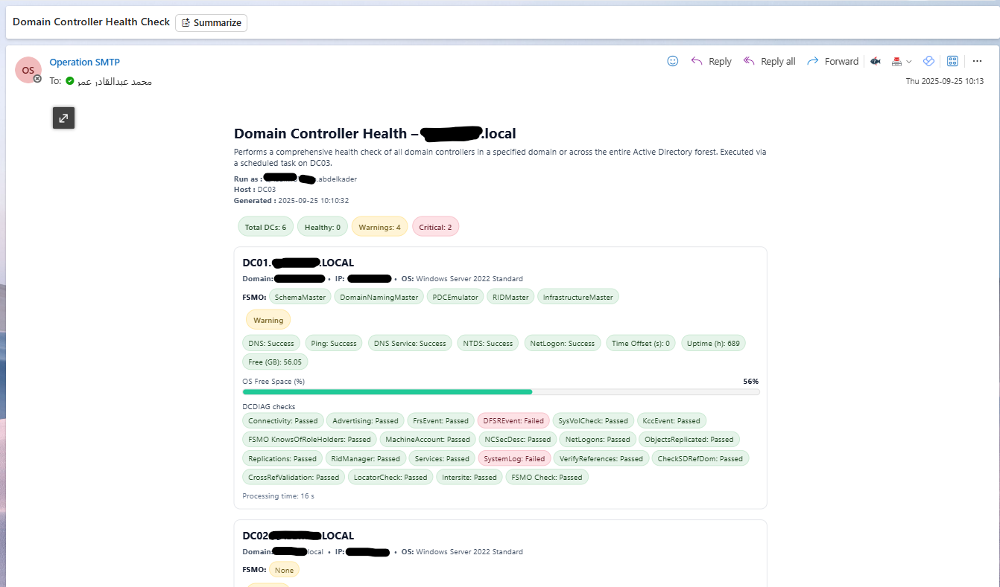

# Get-ADHealth.ps1 — Domain Controller Health Check


## Overview
`Get-ADHealth.ps1` runs a comprehensive health check against all Domain Controllers (DCs) in one or more domains—or the entire forest—and generates a **modern, card-style HTML report**. Optionally, it **emails** the same HTML inline to your operations team.

**Per-DC collectors**
- DNS resolution (`Resolve-DnsName`)
- ICMP reachability (`Test-Connection`)
- Uptime & last reboot (`Win32_OperatingSystem`)
- Time sync drift (`w32tm /stripchart`)
- OS drive free space (%, GB) (`Win32_LogicalDisk`)
- Service status (DNS, NTDS, NetLogon)
- `DCDIAG` suite (Connectivity, Replication, SysVol, FSMO, …)

The report summarizes **Healthy / Warning / Critical** based on binary checks and numeric thresholds.

---


## Screenshots



---
## Requirements

- **Windows PowerShell 5.1**
- **RSAT: Active Directory** PowerShell module  
  Microsoft Docs: <https://learn.microsoft.com/powershell/module/activedirectory/>
- `dcdiag.exe` available (install RSAT or run on a DC)  
  Docs: <https://learn.microsoft.com/windows-server/administration/windows-commands/dcdiag>
- Remote WMI/CIM access to DCs for uptime/disk metrics
- Optional email:
  - SMTP server (e.g., **Exchange Online** `smtp.office365.com:587`)  
    Docs: <https://learn.microsoft.com/exchange/clients-and-mobile-in-exchange-online/authenticated-client-smtp-submission>

---

## Installation

```powershell
# Download/save the script
# e.g., C:\Ops\AD\Get-ADHealth.ps1

# Ensure RSAT:AD is installed (Windows 10/11 example)
Get-WindowsCapability -Online | Where-Object Name -like 'Rsat.ActiveDirectory*'
Add-WindowsCapability -Online -Name Rsat.ActiveDirectory.DS-LDS.Tools~~~~0.0.1.0
````

---

## Parameters

| Name         | Type           | Default                          | Description                                                                             |
| ------------ | -------------- | -------------------------------- | --------------------------------------------------------------------------------------- |
| `DomainName` | `string[]`     | *(all forest domains)*           | One or more domain DNS names to scan. Omit to scan entire forest.                       |
| `ReportPath` | `string`       | `C:\Reports`                     | Folder to save the HTML report.                                                         |
| `SendEmail`  | `switch`       | `False`                          | If present, sends the report inline via SMTP.                                           |
| `Subject`    | `string`       | `Domain Controller Health Check` | Email subject.                                                                          |
| `UserFrom`   | `string`       | `smtp-reports@yourdomain.com`    | SMTP From address.                                                                      |
| `UserTo`     | `string[]`     | `it-admins@yourdomain.com`       | One or more recipients.                                                                 |
| `SmtpServer` | `string`       | `smtp.office365.com`             | SMTP server hostname.                                                                   |
| `Port`       | `int`          | `587`                            | SMTP port.                                                                              |
| `Credential` | `PSCredential` | —                                | SMTP credential. If omitted but `Password` provided, script builds one with `UserFrom`. |
| `Password`   | `SecureString` | —                                | SecureString password for SMTP (used if `Credential` not supplied).                     |

---

## Health Thresholds (tunable in script)

* `UptimeWarnHours = 24`
* `FreePctFail = 5`, `FreePctWarn = 30`
* `FreeGBFail = 5`, `FreeGBWarn = 10`
* `TimeWarnSeconds = 0.5`, `TimeFailSeconds = 1.0`

---

## Usage

### Scan the entire forest and save HTML

```powershell
.\Get-ADHealth.ps1 -ReportPath 'C:\Reports'
```

### Scope to specific domains

```powershell
.\Get-ADHealth.ps1 -DomainName 'contoso.com','emea.contoso.com' -ReportPath 'C:\Reports'
```

### Email the report (inline)

```powershell
$cred = Get-Credential  # SMTP credential (e.g., EXO mailbox)
.\Get-ADHealth.ps1 `
  -SendEmail `
  -Subject 'AD DC Health Check' `
  -UserFrom 'op-smtp@yourtenant.onmicrosoft.com' `
  -UserTo 'it-admins@yourdomain.com','noc@yourdomain.com' `
  -SmtpServer 'smtp.office365.com' -Port 587 `
  -Credential $cred
```

> **Note:** The email body uses the same HTML layout as the saved file for consistency across mediums.

---

## Output

* **Saved HTML**: `ADHealthReport_yyyyMMdd_HHmmss.html` in `ReportPath`
* **Email (optional)**: Inline HTML body with the same card-style layout

---

## Scheduling (Task Scheduler)

1. Place the script, e.g., `C:\Ops\AD\Get-ADHealth.ps1`.
2. Create a task running as a service account with AD/WMI permissions.
3. **Program/script:** `powershell.exe`
   **Arguments:**

   ```text
   -NoProfile -ExecutionPolicy Bypass -File "C:\Ops\AD\Get-ADHealth.ps1" -ReportPath "C:\Reports" -SendEmail -Subject "AD DC Health" -UserFrom "op-smtp@yourtenant.onmicrosoft.com" -UserTo "it-admins@yourdomain.com" -SmtpServer "smtp.office365.com" -Port 587
   ```
4. Enable **Run whether user is logged on or not**.
5. (If needed) **Run with highest privileges**.

---

## How It Works

1. **Discovery**

   * Enumerates domains (`Get-ADForest`) and DCs (`Get-ADDomainController -Filter *`).

2. **Probes per DC**

   * DNS, ICMP, uptime, time drift, disk %, disk GB, service states (DNS/NTDS/NetLogon), and `DCDIAG` tests.

3. **State Calculation**

   * Any critical binary failure (DNS/Ping/Services/critical `DCDIAG`) ⇒ **Critical**.
   * Threshold breaches escalate to **Warning** or **Critical**.

4. **Rendering**

   * Builds an **email-safe HTML** (inline CSS) with **cards**, **badges**, and **meters**.

5. **Delivery**

   * Saves the HTML and, if requested, sends via SMTP.

---

## Security Notes

* **Avoid hard-coding credentials.** Prefer `Get-Credential`, Windows Credential Manager, or **SecretManagement**:
  [https://learn.microsoft.com/powershell/utility-modules/secretmanagement/overview](https://learn.microsoft.com/powershell/utility-modules/secretmanagement/overview)
* `Send-MailMessage` is **deprecated**. It remains functional in many environments, but plan to migrate to:

  * Microsoft Graph **SendMail**: [https://learn.microsoft.com/graph/api/user-sendmail](https://learn.microsoft.com/graph/api/user-sendmail)
  * or **MailKit**: [https://github.com/jstedfast/MailKit](https://github.com/jstedfast/MailKit)

---

## Troubleshooting

* **`ActiveDirectory` module missing**
  Install RSAT (Windows 10/11 Optional Features or DISM/PowerShell).
  Docs: [https://learn.microsoft.com/powershell/module/activedirectory/](https://learn.microsoft.com/powershell/module/activedirectory/)

* **`dcdiag.exe` not found**
  Install RSAT or run the script on a DC.
  Docs: [https://learn.microsoft.com/windows-server/administration/windows-commands/dcdiag](https://learn.microsoft.com/windows-server/administration/windows-commands/dcdiag)

* **CIM/WMI errors**
  Ensure firewall allows WMI/RPC to DCs and the run-as account has rights.

* **Email failures (EXO)**
  Verify mailbox, SMTP AUTH, and TLS settings.
  Docs: [https://learn.microsoft.com/exchange/clients-and-mobile-in-exchange-online/authenticated-client-smtp-submission](https://learn.microsoft.com/exchange/clients-and-mobile-in-exchange-online/authenticated-client-smtp-submission)

---

## References (Microsoft/GitHub)

* Resolve-DnsName: [https://learn.microsoft.com/powershell/module/dnsclient/resolve-dnsname](https://learn.microsoft.com/powershell/module/dnsclient/resolve-dnsname)
* DCDIAG: [https://learn.microsoft.com/windows-server/administration/windows-commands/dcdiag](https://learn.microsoft.com/windows-server/administration/windows-commands/dcdiag)
* Windows Time Service: [https://learn.microsoft.com/windows-server/networking/windows-time-service/windows-time-service-tools-and-settings](https://learn.microsoft.com/windows-server/networking/windows-time-service/windows-time-service-tools-and-settings)
* Win32_OperatingSystem: [https://learn.microsoft.com/windows/win32/cimwin32prov/win32-operatingsystem](https://learn.microsoft.com/windows/win32/cimwin32prov/win32-operatingsystem)
* Win32_LogicalDisk: [https://learn.microsoft.com/windows/win32/cimwin32prov/win32-logicaldisk](https://learn.microsoft.com/windows/win32/cimwin32prov/win32-logicaldisk)
* AD PowerShell: [https://learn.microsoft.com/powershell/module/activedirectory/](https://learn.microsoft.com/powershell/module/activedirectory/)
* Exchange Online SMTP AUTH: [https://learn.microsoft.com/exchange/clients-and-mobile-in-exchange-online/authenticated-client-smtp-submission](https://learn.microsoft.com/exchange/clients-and-mobile-in-exchange-online/authenticated-client-smtp-submission)
* MailKit (alt. SMTP): [https://github.com/jstedfast/MailKit](https://github.com/jstedfast/MailKit)

---

## Changelog

* **v1.0** — Initial release: per-DC probes, DCDIAG parsing, card-style HTML, email delivery.

---

## License

This script is licensed under the [MIT License](https://opensource.org/licenses/MIT)

---

## Disclaimer

> ⚠️ Use responsibly in production. Always test scripts in a staging environment first.
