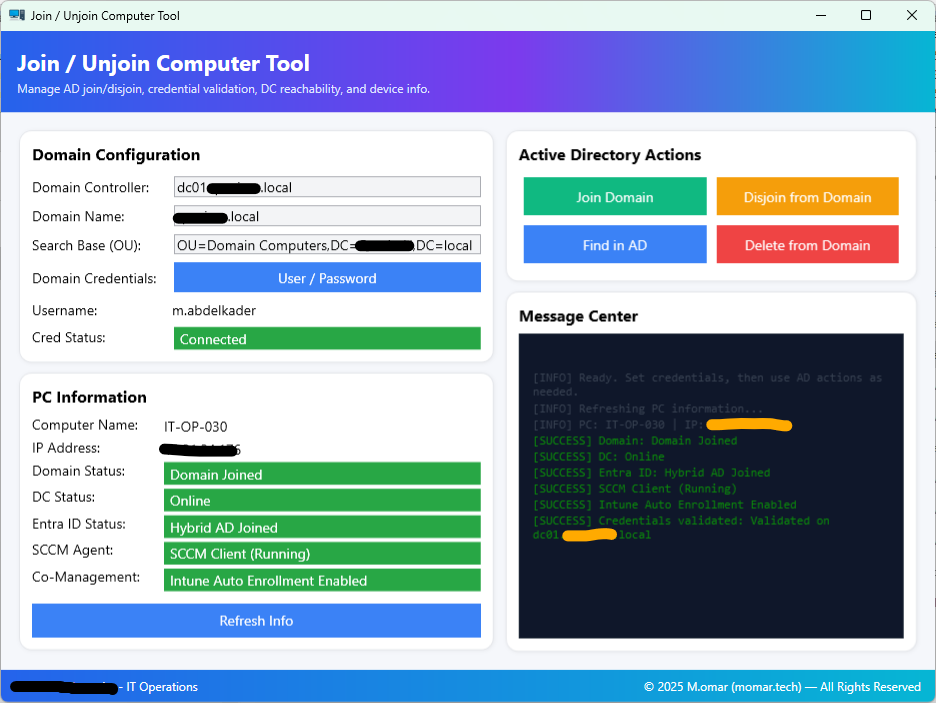

# 🖥️ Join Unjoin Computer Tool


A **PowerShell WPF GUI tool** for IT administrators to manage **computer objects** across **Active Directory (AD)** and **Microsoft Entra ID (Azure AD)**.

Supports joining/disjoining domains, OU selection, deleting AD objects, Entra ID join/leave, Intune enrollment, and showing real-time device posture (Domain, IP, SCCM, Co-Management).

---

## 🚀 Overview

With **JoinUnjoinComputerTool**, you can:

* 🔹 **Join** a computer to Active Directory (with OU selection).
* 🔹 **Disjoin** a computer from AD to a workgroup.
* 🔹 **Delete computer objects** from AD (with validation & warnings).
* 🔹 **Join/Leave Microsoft Entra ID (Azure AD)**.
* 🔹 **Enroll into Microsoft Intune** (personal device).
* 🔹 **Display device information**: Domain, IP, Entra ID, SCCM, Co-Management.

---

## 🖼️ Screenshots

### Main Interface


### OU Picker & Status Display



---

## ✨ Features

* ✅ Join & Disjoin Active Directory (with OU picker)
* ✅ Delete AD computer objects (with safeguards)
* ✅ Entra ID Join/Leave via `dsregcmd`
* ✅ Intune enrollment detection
* ✅ Device info snapshot (Domain, IP, SCCM, Co-Management)
* ✅ WPF GUI with color-coded status (🟢 Active / 🔴 Inactive / 🟠 Needs Attention)
* ✅ Confirmation dialogs for critical actions
* ✅ Logging & error handling

---

## 📦 Versions

This repository contains **two versions** of the tool:

### 🔹 v1 – Classic Build

* Basic join/disjoin functionality.
* AD object deletion with validation.
* Entra ID (Azure AD) join/leave support.
* Intune enrollment as personal device.
* Device info: Domain, IP, Entra ID, SCCM, Co-Management.
* Modern WPF GUI with dynamic color status.

### 🔹 v2 – Enhanced Build (Latest)

* All **v1 features** plus:

  * **Credential validation pill** (Connected / Not Connected / Error).
  * **Domain Controller reachability check** (ports 389/88).
  * **Message Center log** with color-coded entries (INFO, SUCCESS, WARNING, ERROR).
  * **Safer AD deletion** with **double confirmation** and warning if the account is enabled.
  * **Restart prompts** after join/disjoin.
  * **Live Refresh Info** (DC status, Entra ID join, SCCM client, Co-Management).

---

## ⚖️ Version Comparison

| Feature                                 | v1        | v2                                           |
| --------------------------------------- | --------- | -------------------------------------------- |
| Join/Disjoin AD                         | ✅         | ✅                                            |
| OU Picker                               | ✅         | ✅                                            |
| Delete AD Computer                      | ✅ (basic) | ✅ (with enabled check + double confirmation) |
| Entra ID Join/Leave                     | ✅         | ✅                                            |
| Intune Enrollment                       | ✅         | ✅                                            |
| Device Info (Domain, IP, SCCM, Co-Mgmt) | ✅         | ✅ (with live refresh)                        |
| Credential Validation Pill              | ❌         | ✅                                            |
| DC Reachability Test                    | ❌         | ✅                                            |
| Message Center Log                      | ❌         | ✅                                            |
| Restart Prompt                          | ❌         | ✅                                            |

---

## ⚙️ Installation & Usage

### 🔹 Prerequisites

* Windows 10/11 or Windows Server 2016+
* PowerShell **5.1+**
* Must be run as **Administrator**

### 🔹 Run the Tool

```powershell
# Clone repo
git clone https://github.com/mabdulkadr/Scripts.git
cd Scripts/JoinUnjoinComputerTool

# Allow script execution (session only)
Set-ExecutionPolicy -Scope Process -ExecutionPolicy Unrestricted -Force

# Launch tool (v1)
.\JoinUnjoinComputerTool - v1.ps1

# Or launch tool (v2 - recommended)
.\JoinUnjoinComputerTool - v2.ps1
```

You can also use the compiled executables:

* `JoinUnjoinComputerTool - v1.exe`
* `JoinUnjoinComputerTool - v2.exe`

These run without execution policy changes and are easier for helpdesk teams.

---

## 🧰 How It Works

* **Domain Join** → `Add-Computer -DomainName ... -OUPath ...`
* **Domain Disjoin** → `Remove-Computer -WorkgroupName WORKGROUP`
* **AD Delete** → LDAP bind, validates if enabled before deletion
* **Entra ID** → `dsregcmd /join`, `dsregcmd /leave`
* **Device Info** → `Get-CimInstance Win32_ComputerSystem`, `Get-NetIPAddress`, `dsregcmd /status`, `Get-Service ccmexec`
* **Co-Management** → Registry & WMI flags

---

## 🛠️ Troubleshooting

| Issue                         | Cause                         | Fix                                                                           |
| ----------------------------- | ----------------------------- | ----------------------------------------------------------------------------- |
| ❌ Script won’t launch         | Execution policy restrictions | Run `Set-ExecutionPolicy -Scope Process -ExecutionPolicy Unrestricted -Force` |
| ❌ "Server is not operational" | Wrong DC/OU DN                | Verify AD settings and credentials                                            |
| ❌ Entra ID join fails         | Network/permissions           | Run `dsregcmd /status` manually                                               |
| ❌ Co-Management not detected  | SCCM not installed            | Check `CoManagementFlags` registry key                                        |

---

## 📌 Notes

* **v2** is the recommended build for production use.
* **v1** is preserved for transparency and fallback.
* Always **test in staging OUs** before production.
* Use accounts with **delegated rights** for join/disjoin/delete.

---

## 📄 License

This project is licensed under the [MIT License](https://opensource.org/licenses/MIT).

---

## ⚠️ Disclaimer

This script is provided **as-is** without warranty.
The author is **not responsible** for unintended modifications or data loss.
Always test thoroughly before deploying in production.

---

👉 Do you want me to also generate a **CHANGELOG.md** file so you can clearly track what was added in v1 → v2 (and future v3), alongside this README?
